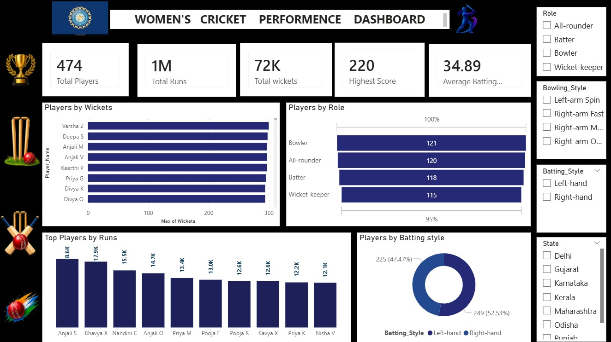

# 🏏 Women's Cricket Performance Dashboard

## 📊 Project Overview

The **Women's Cricket Performance Dashboard** is an interactive **Power BI dashboard** designed to analyze and visualize the performance of women's cricket players.

The dashboard provides insights into player performance based on **runs, wickets, roles, batting styles, bowling styles, and states**. It helps users quickly identify top-performing players and understand overall player distribution.

---

## 🎯 Objectives

- Analyze the overall performance of women's cricket players.
- Identify players with the highest number of runs and wickets.
- Compare players based on their cricketing roles.
- Analyze the distribution of players by batting style.
- Explore player distribution across different states.
- Provide an interactive dashboard for easy performance analysis.

---

## 🛠️ Tools & Technologies

- **Power BI** – Dashboard development and visualization
- **Power Query** – Data cleaning and transformation
- **DAX** – Measures and calculations
- **Microsoft Excel / CSV** – Data source
- **GitHub** – Project documentation and sharing

---

## 📌 Dashboard Features

### 🔹 Key Performance Indicators (KPIs)

The dashboard displays important overall statistics:

- **Total Players:** 474
- **Total Runs:** 1M
- **Total Wickets:** 72K
- **Highest Score:** 220
- **Average Batting Score:** 34.89

### 🔹 Players by Wickets

A bar chart is used to compare players based on their maximum wickets.

This helps identify the leading wicket-taking players.

### 🔹 Players by Role

The dashboard shows the number of players belonging to different cricketing roles:

- Bowler – 121
- All-rounder – 120
- Batter – 118
- Wicket-keeper – 115

### 🔹 Top Players by Runs

The dashboard highlights the top players based on total runs scored.

This visualization makes it easy to compare high-performing batters.

### 🔹 Players by Batting Style

A donut chart represents the distribution between:

- Left-hand batters
- Right-hand batters

### 🔹 Interactive Filters

Users can filter the dashboard using:

- **Role**
- **Bowling Style**
- **Batting Style**
- **State**

These filters allow users to explore specific groups of players.

---

## 📈 Key Insights

From the dashboard:

- The dataset contains **474 players**.
- The highest score recorded is **220**.
- Bowlers represent the largest player-role category with **121 players**.
- All-rounders account for **120 players**.
- Batters account for **118 players**.
- Wicket-keepers account for **115 players**.
- Right-handed players represent approximately **52.53%** of the dataset.
- Left-handed players represent approximately **47.47%** of the dataset.

---

## 🧹 Data Preparation

The dataset was prepared and transformed using **Power Query**.

The data preparation process included operations such as:

- Removing duplicate records
- Removing unnecessary rows
- Handling blank records
- Replacing values
- Transforming columns
- Changing data types
- Creating conditional columns
- Creating custom columns
- Splitting and merging columns
- Pivoting and unpivoting data
- Promoting the first row as headers
- Standardizing text formatting

---

## 📊 Dashboard Preview


---

## 📂 Project Structure

```text
Womens-Cricket-Performance-Dashboard/
│
├── README.md
├── Womens_Cricket_Dataset.csv
├── Womens_Cricket_Dashboard.pbix
└── womencricketer_dashboard.png

🖼️ Dashboard Preview


💡 Skills Demonstrated
Data Analysis
Data Visualization
Power BI Dashboard Development
Power Query
DAX
Data Cleaning & Transformation
KPI Development
Interactive Slicers
Business Intelligence
Data Storytelling

👩‍💻 Project By

Srimathy R

Aspiring Data Analyst | Power BI | SQL | Excel | Python
